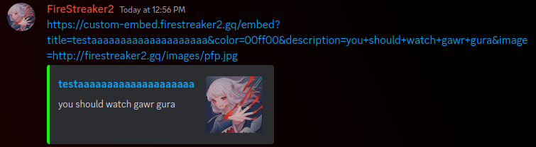
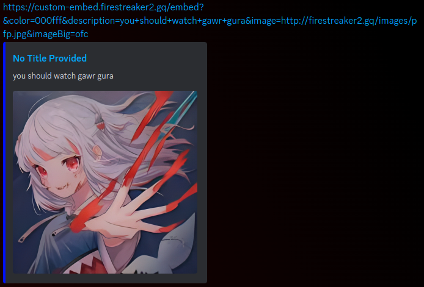

# About
CustomEmbed was designed for users to make custom embeds for discord, as implied from the name. It was built with express, and utilizes user input to customize <a href="https://developer.mozilla.org/en-US/docs/Web/HTML/Element/meta">meta tags</a>, which can affect the embeds that discord shows as a result of a link being posted. While this project does technically work, I recommend you use something more efficient, like <a href="https://discohook.org/">discohook</a> instead.

# Usage
Base URL: ``custom-embed.firestreaker2.gq``
| Parameters   | Type    | Description                                  |
| -------------|---------|----------------------------------------------|
| Title        | String  | Title of the embed                           |
| Color        | Integer | Color of the embed (in hex form, ex. 000000) |
| Description  | String  | Description of the embed                     |
| Image        | String  | URL of the image                             |
| ImageBig     | Boolean | Whether or not the image is big              |
> Note that while there are more embed options than just the ones listed above, there is not always a corresponding HTML meta tag for it, resulting in there being only a limited amount of options provided.

# Examples
Example 1:


Example 2:


# Selfhosting
If you would like to selfhost this project, you may.
```bash
$ git clone https://github.com/FireStreaker2/CustomEmbed.git
$ cd CustomEmbed
$ npm i
$ npm start
```

# License
<a href="https://github.com/FireStreaker2/CustomEmbed/blob/main/LICENSE">MIT</a>